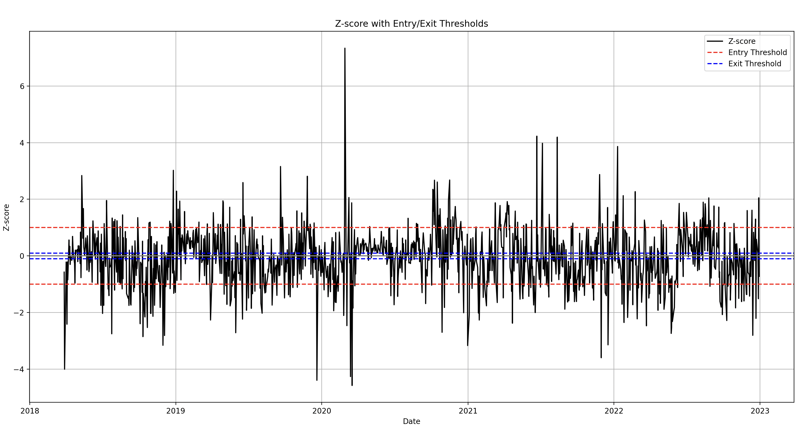

# stat-arb-engine

Statistical Arbitrage Engine built from scratch using Python.

This project demonstrates my interest in quantitative finance and statistical modeling by implementing a pair trading strategy —- from data acquisition and pair selection to signal generation, backtesting, and visualization. It applies mathematical techniques like cointegration, z-score normalization, and time series analysis to financial market data.

---

## What It Does

This engine identifies **cointegrated pairs** and simulates a **mean-reversion trading strategy** using the spread between their prices.

### Key Features:
- Collects and preprocesses stock data using `yfinance`.
- Uses **Engle-Granger cointegration tests** to identify statistically viable pairs.
- Constructs a **spread** between the two assets and generates trading signals based on **Z-score thresholds**.
- Backtests the strategy with configurable parameters and visualizes the spread with **entry/exit markers**.

---

## Core Concepts

- **Cointegration Testing** for identifying long-term relationships between assets.
- **Z-Score-based Signal Generation** for statistical entry/exit rules.
- **Backtesting** with trade tracking, P&L logging, and optional slippage parameters.
- **Data Cleaning, Resampling, and Visualization** using Python’s data stack.

---

## 🗂 Project Structure

| File | Description |
|------|-------------|
| `main.py` | Orchestrates the workflow: fetch → analyze → signal → backtest → plot |
| `fetch_data.py` | Downloads OHLC data using `yfinance` |
| `cointegration.py` | Computes and filters statistically cointegrated pairs |
| `signals.py` | Creates entry/exit signals based on Z-score of spread |
| `backtester.py` | Executes trades, tracks P&L, logs strategy performance |
| `pair_analysis.py` | Filters and scores pairs based on correlation and stationarity |
| `plotter.py` | Visualizes spread and signals on a matplotlib chart |

---

## 📦 Requirements

Install dependencies using:
```bash
pip install -r requirements.txt
```

**`requirements.txt` includes:**
- numpy
- pandas
- matplotlib
- statsmodels
- yfinance

---

## 🚀 How to Run

```bash
python main.py
```

You can customize:
- The ticker universe (e.g., S&P 500 components)
- Start/end date
- Cointegration p-value threshold
- Z-score entry/exit rules
- Lookback window

---

## 📊 Example Output


- Green ▲ = LONG entry  
- Red ▼ = SHORT entry  
- Blue ● = CLOSE (mean reversion)




---
